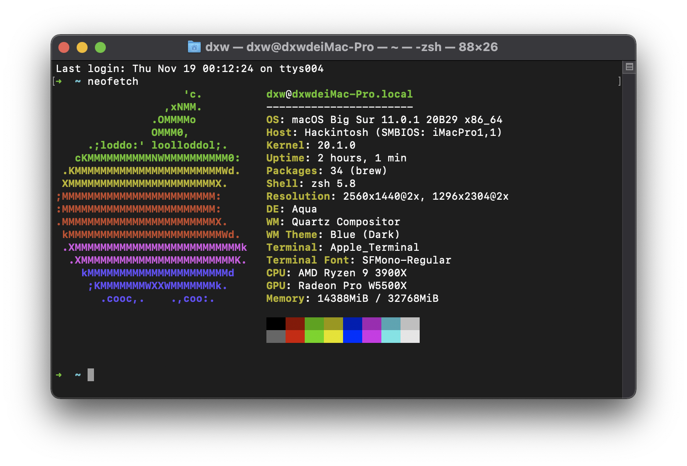
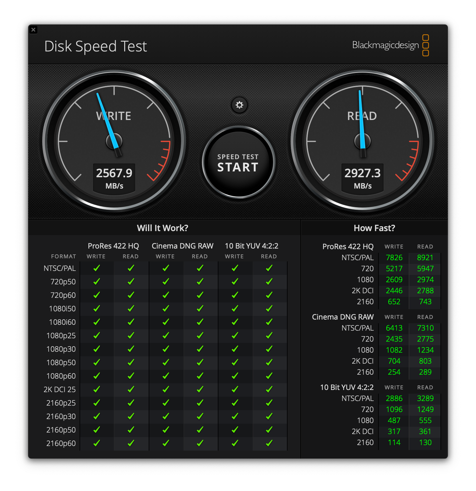
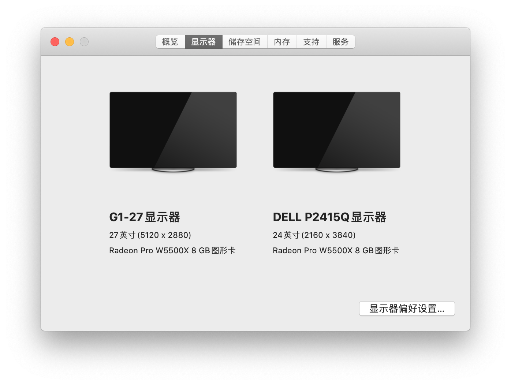
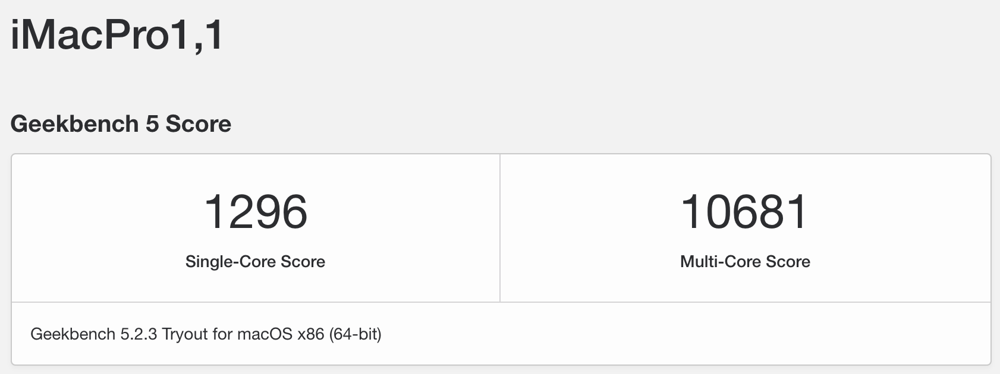

# 近期更新

> 2021.06.09：
> ✅ 支持Big Sur 11.4
> 
> 2020.11.19：
> NVMe在AMD上识别为外部磁盘，如果不需要可以删除 DeviceProperties 下 PciRoot(0x0)/Pci(0x1,0x1)/Pci(0x0,0x0)  的项目

# 一部AMD Yes! 的黑苹果OpenCore配置
> 如果在同样的硬件上运行，请注意两项内容：
>  1. Serial等需要重新生成 参考 [OpenCore Install Guide # platforminfo](https://dortania.github.io/OpenCore-Install-Guide/AMD/zen.html#platforminfo)
>  2. 定制FBname如果无效 需要用 [Hackintool](https://github.com/headkaze/Hackintool/releases) 检查显卡的PciRoot路径

||主要部件|
| ---- | ---- |
|主板|**GIGABYTE B550M AORUS PRO**|
|处理器|**AMD Ryzen 9 3900X**|
|硬盘|**WD_BLACK SN750 500GB**|
|内存|**Kingston DDR4 3200 16GB** `x2`|
|显卡|**Gigabyte RX 5500XT OC 8G**|

# 截图

# 性能

# DIY 显示器

# 参考
*  [B550 Boards now work on macOS](https://forum.amd-osx.com/index.php?threads/b550-boards-now-work-on-macos.713)
*  [OpenCore Install Guide # Ryzen and Threadripper(17h)](https://dortania.github.io/OpenCore-Install-Guide/AMD/zen.html#booter)
*  [[EB|#LOG:EXITBS:START] ERROR ](https://dortania.github.io/OpenCore-Install-Guide/troubleshooting/troubleshooting.html#stuck-on-eb-log-exitbs-start)
* [黑苹果AMD RX5500XT定制FBname 提升显卡性能](https://macx.top/8748.html)
* [SMCAMDProcessor](https://github.com/trulyspinach/SMCAMDProcessor)

# 工具
* [gibMacOS](https://github.com/corpnewt/gibMacOS)
* [MountEFI](https://github.com/corpnewt/MountEFI)
